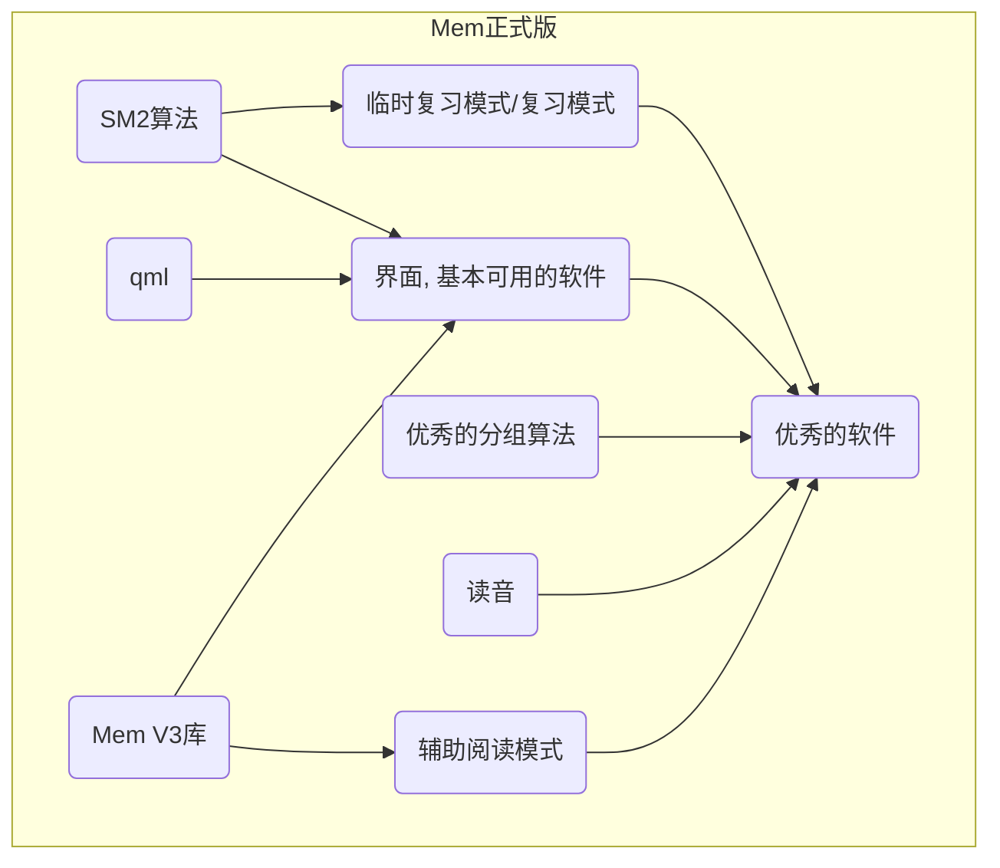

V4，重构V3

---

### 项目规划

###### 整体关键功能：

分组算法，查看模式，复习模式（SM2算法的实现），UI界面优化，AI侧边界面，辅助阅读模式



##### qml，MemV4

----

我有一个背单词的核心想法
把不会的单词围绕某一个场景写成一段话，以下描述的软件就是我针对这个想法的展开。

我有一个json文件，这个文件内记录了每个单词的，word，和translation对象（词性，中文翻译）数组，和phrase对象数组（短语，中文翻译），
我打算把文件读入并分组存入数据库中，
设计了一个数据库，SQL在最后展示。我的以Book（包含了WordGroup数组，每个WordGroup里又中包含了Word，（每个Word里包含了Translation，，，，））
类来读取一个Josn文件，并用分组算法划分合适的单词，再写入到数据库中，数据库中读出的数据最小单位以word来读取。
读出的所有数据以数据库中的形式组织使用，用BookSchema，WodGroupSchema，，，，的类来存放。

我的软件在使用时，用户在主页可以选择（使用json文件）创建单词书，或者使用数据库中已有的单词书，
选择一本单词书会弹出窗口显式书的详细信息，书名bookname，书的描述description，选择学习复习模式

- 学习模式下，软件弹出界面，并自动读取未学习的单词组（一般选5组）展示这5组单词组的标签Tag和词组的wordgroup_id给用户，用户点击下一步
  将会自动弹出页面，以一个复选框的形式勾选自己认识的单词，（展示单词本身，和一个短语（如果有）勾选后会自动展示单词的翻译，以查看是否真的认识），完成单词筛选后，将用户勾选的单词标记为认识，
  点击下一步，
  这个页面将以列表的形式列出本组单词中所有用户不会的单词，灰度显示完整翻译，短语（只展示一个），
  最后一栏点击查看（会弹出一个单词页面，查看单词最完整的信息，和所有的短语），
  最底部展示一个用于存放造句的文本框
  （鼓励用户以造句的形式将该组所有的单词融入一段场景，如果句子文本框为空，或引用文本框引用率（引用数量）低，提醒用户是否真的要进行下一步学习），
  还有一个json文本框用于存储引用了本组单词和在句子中的形式（用户也可以自己单词，输入的单词将写入other字段里），
  以及一个note用于记录用户自己的笔记

用户点击保存，就写入数据库中，
然后再次弹出筛选框，展示单词本身，单词短语，用户勾选自己不会的单词
（如果用户不会这个单词，且这个单词不在单词引用里，代表这个单词不在句子中，（未处理情况1），
如果有出现在单词引用里，就在文本框中展示用户自己撰写的英文段落，并高亮展示翻译），

进行下一组单词，直到五组单词学完，回到书籍页面。

复习模式下，软件弹出页面，自动读取根据SM2算法维护的复习表，并找到需要复习的单词组，用户点击开始
展示一组单词，和短语，勾选用户不会的单词
（如果用户不会这个单词，且这个单词不在单词引用里，代表这个单词不在句子中，（未处理情况1），
如果有出现在单词引用里，就在最上方文本框中展示用户撰写的段落，并且灰度显示翻译），
点击下一步，进行下一组的复习

对于未处理情况1，我计划将来可以从原单词组中抽取出所有这样的单词（在word表中加入一个“try_next”的字段），放入一张新的表中，然后当用户学完这本书时，在根据这张表重新生成组插入回WordGroup中，
用户继续使用学习模式来学习这些单词，并且将这些单词的（try_next）字段清理，如果再次遇到未处理情况1，则继续如此。

计划接入ai，判断用户使用的单词造句是否正确。
计划在用户使用ctrl+左键点击单词时弹出一个小窗口用于展示浏览器，默认google搜索读音和用法
计划，当用户在同一个单词多次不认识，但给出句子后明白时，先展示单词组，再不认识继续展示句子，和意思。
计划加入阅读模式，ctrl+左键点选不会的单词，（自动查找所有组的单词引用，是否存在这个单词），有则展示用户自己编写的例句，灰度展示其意思
没有就在侧边栏里弹出浏览器自动调用谷歌搜索该单词

```sql
-- 创建BookList表
CREATE TABLE Book (
    book_id INTEGER PRIMARY KEY AUTOINCREMENT,
        book_name TEXT,
        book_description TEXT
);

-- 创建WordGroup表
CREATE TABLE WordGroup (
        book_id INTEGER NOT NULL,
    wordgroup_id INTEGER PRIMARY KEY AUTOINCREMENT,

    wordgroup_tag TEXT,
        sentence_reference TEXT,
        wordgroup_mark BOOLEAN DEFAULT FALSE,
        note TEXT,

        FOREIGN KEY(book_id) REFERENCES Book(book_id)
);

-- 创建Word表
CREATE TABLE Word (
        wordgroup_id INTEGER NOT NULL,
    word_id INTEGER PRIMARY KEY AUTOINCREMENT,

    word_context TEXT NOT NULL,
    word_mark BOOLEAN DEFAULT false,


        FOREIGN KEY(wordgroup_id) REFERENCES WordGroup(wordgroup_id)
);

CREATE TABLE Translation (
        word_id INTEGER NOT NULL,
        translation_id INTEGER PRIMARY KEY AUTOINCREMENT,

        type TEXT,
        translation_context TEXT,

        FOREIGN KEY (word_id) REFERENCES Word(word_id)

);

CREATE TABLE Phrase(
        word_id INTEGER NOT NULL,
        phrase_id INTEGER PRIMARY KEY AUTOINCREMENT,

        phrase_context TEXT,
        phrase_translation TEXT,

        FOREIGN KEY (word_id) REFERENCES Word(word_id)

);

-- 创建Sentence表
CREATE TABLE Sentence (

        wordgroup_id INTEGER ,
        sentence_id INTEGER PRIMARY KEY AUTOINCREMENT,

    sentence_context TEXT NOT NULL,
        FOREIGN KEY (wordgroup_id) REFERENCES WordGroup(wordgroup_id)
);
```
